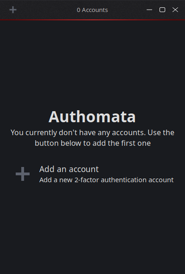

# ⚙️ Authomata
Two-factor authentication app for Linux




# 🛠 Build
Make sure you have the latest version of `LDC and Dub` and `oath-toolkit` installed on your computer. Then run:

```bash
dub run --compiler=ldc --build=release
```

# 📜 License
Authomata is free software; you can redistribute it and/or modify it under the terms of the GNU General Public License as published by the Free Software Foundation and appearing in the file [LICENSE](LICENSE)